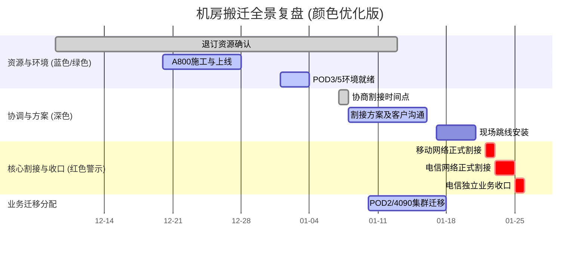

```mermaid
gantt
    title 机房搬迁全景复盘 (颜色优化版)
    dateFormat  YYYY-MM-DD
    axisFormat %m-%d

    section 资源与环境 (蓝色/绿色)
    退订资源确认        :done,  a1, 2025-12-09, 2026-01-13
    A800施工与上线      :active, a2, 2025-12-20, 2025-12-28
    POD3/5环境就绪      :active, a3, 2026-01-01, 2026-01-04

    section 协调与方案 (深色)
    协商割接时间点      :done, b1, 2026-01-07, 1d
    割接方案及客户沟通   :active, b2, 2026-01-08, 2026-01-16
    现场跳线安装        :b3, 2026-01-17, 2026-01-21

    section 核心割接与收口 (红色警示)
    移动网络正式割接    :crit, c1, 2026-01-22, 1d
    电信网络正式割接    :crit, c2, 2026-01-23, 2d
    电信独立业务收口    :crit, c3, after c2, 1d

    section 业务迁移分配
    POD2/4090集群迁移   :active, d1, 2026-01-10, 2026-01-18
```