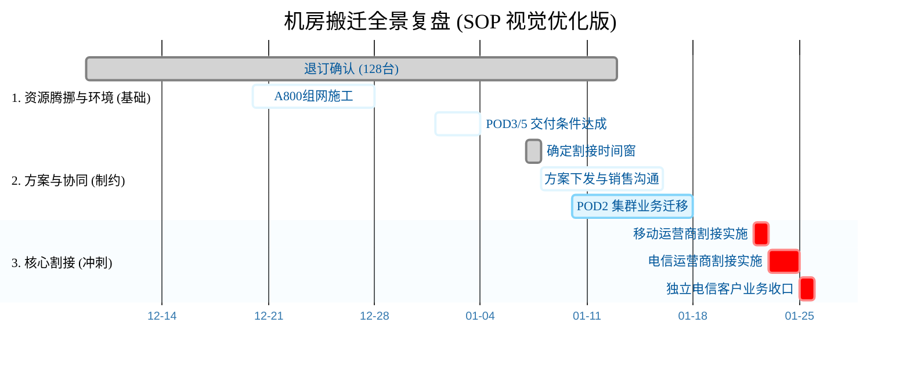

```mermaid
%%{init: {
  'theme': 'base',
  'themeVariables': {
    'fontFamily': 'arial, sans-serif',
    'fontSize': '14px',
    'primaryColor': '#e1f5fe',
    'primaryTextColor': '#01579b',
    'primaryBorderColor': '#81d4fa',
    'lineColor': '#546e7a',
    'secondaryColor': '#f1f8e9',
    'tertiaryColor': '#fff'
  }
}}%%
gantt
    title 机房搬迁全景复盘 (SOP 视觉优化版)
    dateFormat  YYYY-MM-DD
    axisFormat %m-%d

    section 1. 资源腾挪与环境 (基础)
    退订确认 (128台)           :done, a1, 2025-12-09, 2026-01-13
    A800组网施工              :active, a2, 2025-12-20, 2025-12-28
    POD3/5 交付条件达成        :active, a3, 2026-01-01, 2026-01-04

    section 2. 方案与协同 (制约)
    确定割接时间窗             :done, b1, 2026-01-07, 1d
    方案下发与销售沟通         :active, b2, 2026-01-08, 2026-01-16
    POD2 集群业务迁移          :b3, 2026-01-10, 2026-01-18

    section 3. 核心割接 (冲刺)
    移动运营商割接实施         :crit, c1, 2026-01-22, 1d
    电信运营商割接实施         :crit, c2, 2026-01-23, 2d
    独立电信客户业务收口       :crit, c3, after c2, 1d
```