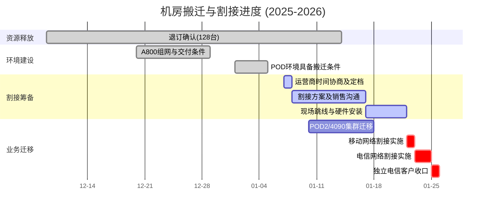

```mermaid
gantt
    title 机房搬迁与割接进度 (2025-2026)
    dateFormat  YYYY-MM-DD
    axisFormat %m-%d

    section 资源释放
    退订确认(128台)           :done, a1, 2025-12-09, 36d

    section 环境建设
    A800组网与交付条件        :done, b1, 2025-12-20, 9d
    POD环境具备搬迁条件       :done, b2, 2026-01-01, 4d

    section 割接筹备
    运营商时间协商及定档      :active, c1, 2026-01-07, 1d
    割接方案及销售沟通        :active, c2, after c1, 9d
    现场跳线与硬件安装        :active, c3, 2026-01-17, 5d

    section 业务迁移
    POD2/4090集群迁移        :d1, 2026-01-10, 8d
    移动网络割接实施          :crit, d2, 2026-01-22, 1d
    电信网络割接实施          :crit, d3, 2026-01-23, 2d
    独立电信客户收口          :crit, d4, after d3, 1d

```