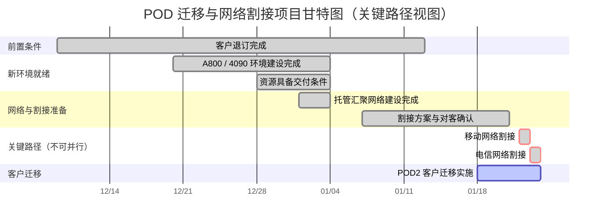

```mermaid
gantt
    title POD 迁移与网络割接项目甘特图（关键路径视图）
    dateFormat  YYYY-MM-DD
    axisFormat  %m/%d

    section 前置条件
    客户退订完成                 :done,    a1, 2025-12-09, 2026-01-13

    section 新环境就绪
    A800 / 4090 环境建设完成     :done,    b1, 2025-12-20, 2026-01-04
    资源具备交付条件             :done,    b2, 2025-12-28, 2026-01-04

    section 网络与割接准备
    托管汇聚网络建设完成         :done,    c1, 2026-01-01, 2026-01-04
    割接方案与对客确认           :done,    c2, 2026-01-07, 2026-01-21

    section 关键路径（不可并行）
    移动网络割接                 :crit,done, d1, 2026-01-22, 1d
    电信网络割接                 :crit,done, d2, 2026-01-23, 2026-01-24

    section 客户迁移
    POD2 客户迁移实施             :active,  e1, 2026-01-18, 2026-01-24

```