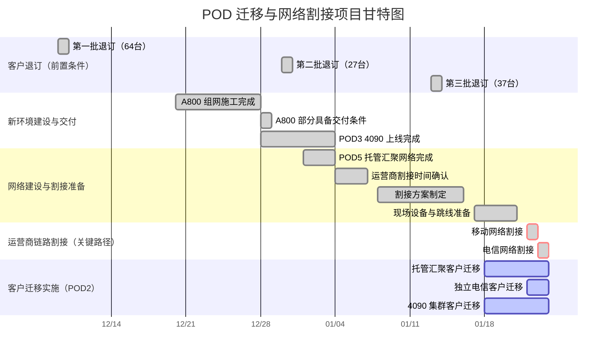

```mermaid
gantt
    title POD 迁移与网络割接项目甘特图
    dateFormat  YYYY-MM-DD
    axisFormat  %m/%d

    section 客户退订（前置条件）
    第一批退订（64台）        :done,    t1, 2025-12-09, 1d
    第二批退订（27台）        :done,    t2, 2025-12-30, 1d
    第三批退订（37台）        :done,    t3, 2026-01-13, 1d

    section 新环境建设与交付
    A800 组网施工完成         :done,    n1, 2025-12-20, 2025-12-28
    A800 部分具备交付条件     :done,    n2, 2025-12-28, 1d
    POD3 4090 上线完成        :done,    n3, 2025-12-28, 2026-01-04

    section 网络建设与割接准备
    POD5 托管汇聚网络完成    :done,    l1, 2026-01-01, 2026-01-04
    运营商割接时间确认       :done,    l2, 2026-01-04, 2026-01-07
    割接方案制定             :done,    l3, 2026-01-08, 2026-01-16
    现场设备与跳线准备       :done,    l4, 2026-01-17, 2026-01-21

    section 运营商链路割接（关键路径）
    移动网络割接             :crit,done, c1, 2026-01-22, 1d
    电信网络割接             :crit,done, c2, 2026-01-23, 2026-01-24

    section 客户迁移实施（POD2）
    托管汇聚客户迁移         :active,  m1, 2026-01-18, 2026-01-24
    独立电信客户迁移         :active,  m2, 2026-01-22, 2026-01-24
    4090 集群客户迁移        :active,  m3, 2026-01-18, 2026-01-24

```