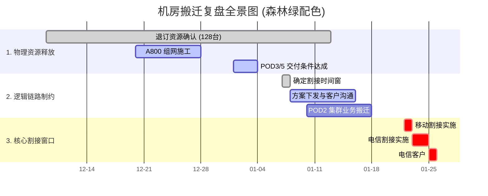

```mermaid
%%{init: {
  'theme': 'base',
  'themeVariables': {
    'fontFamily': 'arial, sans-serif',
    'fontSize': '14px',
    /* 全局背景与文字 */
    'primaryColor': '#c8e6c9',
    'primaryTextColor': '#1b5e20',
    'primaryBorderColor': '#81c784',
    /* 已完成任务（浅绿） */
    'doneSectionBkgColor': '#f1f8e9',
    'doneSectionBorderColor': '#c5e1a5',
    /* 进行中/活动任务（翠绿） */
    'activeSectionBkgColor': '#a5d6a7',
    'activeSectionBorderColor': '#66bb6a',
    /* 关键路径/核心割接（深绿 - 保证文字对比度） */
    'critSectionBkgColor': '#2e7d32',
    'critSectionBorderColor': '#1b5e20',
    'critTextColor': '#ffffff',
    /* 连线与轴 */
    'lineColor': '#4caf50',
    'gridColor': '#e8f5e9'
  }
}}%%
gantt
    title 机房搬迁复盘全景图 (森林绿配色)
    dateFormat  YYYY-MM-DD
    axisFormat %m-%d

    section 1. 物理资源释放
    退订资源确认 (128台)           :done, a1, 2025-12-09, 2026-01-13
    A800 组网施工                 :active, a2, 2025-12-20, 2025-12-28
    POD3/5 交付条件达成            :active, a3, 2026-01-01, 2026-01-04

    section 2. 逻辑链路制约
    确定割接时间窗                :done, b1, 2026-01-07, 1d
    方案下发与客户沟通            :active, b2, 2026-01-08, 2026-01-16
    POD2 集群业务搬迁             :b3, 2026-01-10, 2026-01-18

    section 3. 核心割接窗口
    移动割接实施              :crit, c1, 2026-01-22, 1d
    电信割接实施              :crit, c2, 2026-01-23, 2d
    电信客户             :crit, c3, after c2, 1d
```